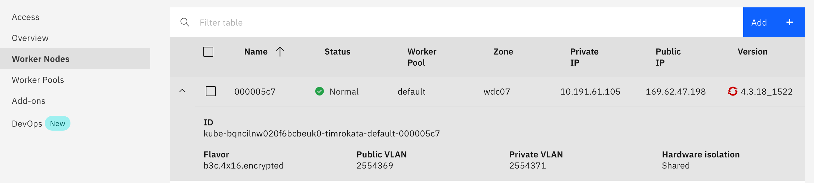

# Infrastructure as Code: Creating Classic VSI in a specific datacenter and vlan

<!--

Check list for every README:
- Verify the requirement are the same, make sure the required plugins are there
- Modify the Project Requirements section. It should be different for every project
- Modify the Project Validation section. It should be different for every project

-->

## Introduction

This example shows how to create one or more master nodes and one or more slave nodes using IBM classic infrastructure services. This pattern will require the classic infrastructure user id and classic infrastructure api key of a member of the account. This can be the account owner, or another user which has been assigned classic infrastructure "superuser" permissions in the **Access (IAM) -> Users -> (specific user) -> Classic Infrastructure** tab.

Depending on preference, this code can be used with either local terraform cli or for users who don't usually use terraform, the code can be deployed using an IBM Cloud [Schematics](https://cloud.ibm.com/docs/schematics?topic=schematics-about-schematics) workspace. Using Schematics is easy for users new to Infrastructure as Code and it's highly recommended to quickly get things going.

The only requirement to use Schematics is the `ibmcloud` cli and the `schematics` plugin - the first two items in [General Requirements](#general-requirements)

To customize the deployment, such as different size (cpu, memory, disks) or quantity of nodes, fork this repository and update the settings in the `variables.tf` file updating the map for the master or slave device. If using terraform, deploy after the updates. If using Schematics, push your changed code to a git repostiory and update the `workspace.json` git url to the new repo.

- [Infrastructure as Code: Managing Compute & Storage Resources](#infrastructure-as-code-managing-compute--storage-resources)
  - [General Requirements](#general-requirements)
  - [Project Requirements](#project-requirements)
  - [How to use with Schematics](#how-to-deploy-with-schematics)
  - [How to use with Terraform](#how-to-deploy-with-terraform)

## General Requirements

The full setup requirements are documented in the [Environment Setup](https://ibm.github.io/cloud-enterprise-examples/iac/setup-environment). It includes:

- [Install IBM Cloud CLI](https://ibm.github.io/cloud-enterprise-examples/iac/setup-environment#install-ibm-cloud-cli)
- [Install the IBM Cloud CLI Plugins](https://ibm.github.io/cloud-enterprise-examples/iac/setup-environment#ibm-cloud-cli-plugins) `infrastructure-service` and `schematics`
- [Login to IBM Cloud with the CLI](https://ibm.github.io/cloud-enterprise-examples/iac/setup-environment#login-to-ibm-cloud)
- [Install Terraform](https://ibm.github.io/cloud-enterprise-examples/iac/setup-environment#install-terraform)
- [Install IBM Cloud Terraform Provider](https://ibm.github.io/cloud-enterprise-examples/iac/setup-environment#configure-access-to-ibm-cloud)
- [Configure access to IBM Cloud](https://ibm.github.io/cloud-enterprise-examples/iac/setup-environment#configure-access-to-ibm-cloud) for Terraform and the IBM Cloud CLI
- (Optional) Install some utility tools such as: [jq](https://stedolan.github.io/jq/download/)

Executing these commands to validate requirements installed as appropriate:

```bash
ibmcloud --version
ibmcloud plugin show infrastructure-service | head -3
ibmcloud plugin show schematics | head -3
ibmcloud target   // perform after 'ibmcloud login'
terraform version
ls ~/.terraform.d/plugins/terraform-provider-ibm_*
```

## Project Requirements

This project requires the following actions to configure properties before running the deployment

1. Copy the `workspace.tmpl.json` file to a file named `workspace.json`. Note if you will be using Schematics and do not plan to customize the number of nodes or sizes, you technically just need to download this file instead of cloning the full repository.

1. Have a SSH Key pair or create one with the command `ssh-keygen`. Replace the `PUBLIC_KEY` value in `workspace.json` with the full contents of the key pair public key (the file ending in `.pub`). For local terraform, add this to the `credentials.tf` or use a `secrets.auto.tfvars` file.

1. Go to the IBM Cloud **Access (IAM)** menu and navigate to a user that has permissions to create classic infrastructure. Scroll down on the first panel the the API Keys section. If a **Create Classic infrastructure key** button is displayed, create a key and make a note of the user name and the api key. Otherwise, scroll down in the list of API keys and select the **Classic infrastructure key** to view the details. Update the `workspace.json` file `IAAS_USER` with the user id and the `IAAS_API_KEY` with the api key. For local terraform, add these values to the `credentials.tf` file or use a `secrets.auto.tfvars` file.

    > after adding these values to the `credentials.tf` file, be sure not to **ever** commit and push this file to a public repository. It's safer to use `secrets.auto.tfvars` which is excluded by a `.gitnore`

1. To create VMs in the same datacenter and vlans as workers for your Kubernetes/OpenShift cluster, open the [Clusters view](https://cloud.ibm.com/kubernetes/clusters) and select the desired cluster. Go to the **Worker Nodes** panel and expand one of the workers:

    

    Make a note of the datacenter, public vlan id and private vlan id. Use these values to update the `workspace.json` file `DATACENTER`, `PUBLIC_VLAN` and `PRIVATE_VLAN` values. Last, update the `REGION` to match the IBM Cloud region for your cluster (e.g. `us-south`, `us-east`, etc.) For local terraform add these values to the `variables.tf` file.

## How to deploy with Schematics

Execute the following commands:

```bash
# Create workspace:
ibmcloud schematics workspace list
ibmcloud schematics workspace new --file workspace.json
ibmcloud schematics workspace list          # Identify the WORKSPACE_ID
WORKSPACE_ID=

# ... wait until the status is INACTIVE

# (Optional) Planing:
ibmcloud schematics plan --id $WORKSPACE_ID  # Identify the Activity_ID
ibmcloud schematics logs --id $WORKSPACE_ID --act-id Activity_ID

# ... wait until it's done

# Apply:
ibmcloud schematics apply --id $WORKSPACE_ID # Identify the Activity_ID
ibmcloud schematics logs  --id $WORKSPACE_ID --act-id Activity_ID
```

After initial provisioning, the workers will run provisioning from the `scripts` directory including updating packages and installing the `ibmcloud`, `kubectl`, and `oc` clis and then restart. Allow about 5-6 minutes after the provisioning activity finishes before logging in to the instance for the first time.

When finished with the environment, removing the virtual machine resources is accomplished with the `destroy` command:

```bash

ibmcloud schematics destroy --id $WORKSPACE_ID # Identify the Activity_ID
ibmcloud schematics logs  --id $WORKSPACE_ID --act-id Activity_ID

```

If you also wish to delete the workspace, this can be done with the `delete` command. This can be skipped if at a later date, the virtual machines with the same configuration (quantity, cpu, memory, public and private vlan) will be needed again.

```bash
ibmcloud schematics workspace delete --id $WORKSPACE_ID
ibmcloud schematics workspace list
```

## How to deploy with Terraform

To deploy using the Terraform cli (you will need to have copied the property data into `credentials.tf` and `variables.tf` as above) execute the following:

```bash
terraform init
terraform plan
terraform apply
```

After initial provisioning, the workers will run provisioning from the `scripts` directory including updating packages and installing the `ibmcloud`, `kubectl`, and `oc` clis and then restart. Allow about 5-6 minutes after the provisioning activity finishes before logging in to the instance for the first time.

Finally, when you finish using the infrastructure, cleanup everything you created with the execution of:

```bash
terraform destroy
```
